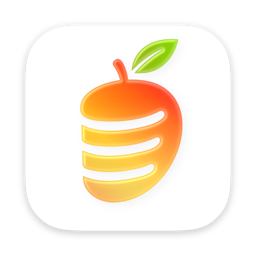
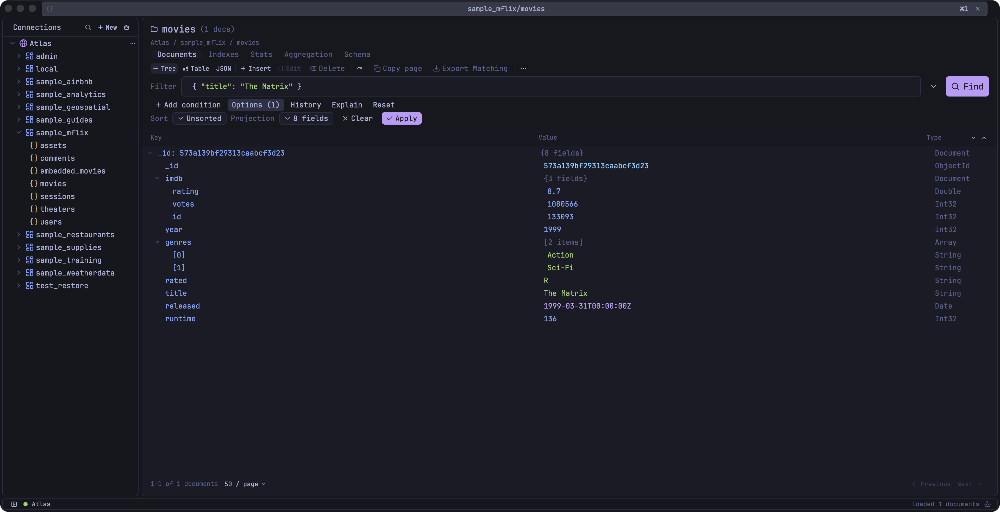
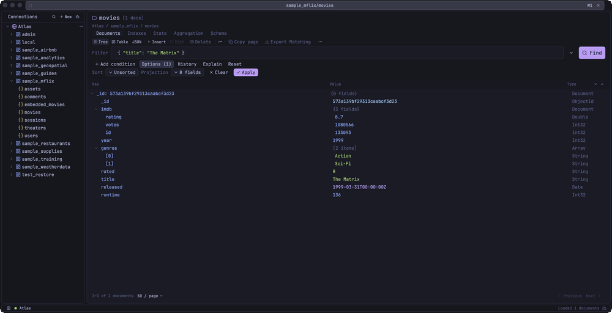

<p align="center">
  
</p>

<h1 align="center">OpenMango</h1>

<p align="center">
  <strong>A native MongoDB GUI for macOS, Windows, and Linux.</strong><br />
  It opens in half a second, stays light on big collections, and every feature is free.
</p>

<p align="center">
  <a href="https://openmango.app">Website</a> ·
  <a href="https://github.com/ggagosh/openmango/releases/latest">Download</a> ·
  <a href="https://github.com/ggagosh/openmango/releases/tag/nightly">Nightly</a> ·
  <a href="CHANGELOG.md">Changelog</a>
</p>

<p align="center">
  <a href="https://github.com/ggagosh/openmango/releases/latest"></a>
  <a href="https://github.com/ggagosh/openmango/actions/workflows/ci.yml"></a>
  <a href="https://github.com/ggagosh/openmango/blob/main/LICENSE"></a>
</p>

<p align="center">
  
</p>

> [!NOTE]
> **Status:** actively developed and pre-1.0; the current release is 0.4.1. macOS releases are signed and notarized.

## Why OpenMango

OpenMango is one desktop app for day-to-day MongoDB work: browsing, editing, querying, aggregating, tuning, and moving data. It is written in Rust with [GPUI](https://gpui.rs) and drawn on the GPU, with no Electron or web views inside.

- **It is fast and light.** The window is up 0.5 seconds after launch, and the app uses about 110 MB with a collection open. Memory follows the page you are looking at, not the size of the collection. The numbers are under [Performance](#performance).
- **Every feature is free.** There are no paid tiers, connection limits, or accounts. The licence is GPL-3.0.
- **Writes are guarded.** A connection can be read-only, production connections ask before writing, and History can put a document back the way it was.
- **Nothing is collected.** There is no telemetry, and credentials stay in the operating system's keychain.

## Built around what MongoDB users ask for

The same requests come up again and again in MongoDB forums and feature trackers. This is what OpenMango does about each of them.

### Working with documents

- **Update many documents without dropping to the shell.** Run bulk updates and deletes from the collection view. OpenMango counts the documents that match and shows you the filter before it writes anything.
- **See schemaless data as a table.** Switch between a tree, a table, and syntax-highlighted Extended JSON. Nested fields expand inside the table, and columns can be hidden and resized.
- **Edit values without fighting their types.** Edit in place or in a full JSON editor. Values accept mongosh forms such as `ObjectId("…")`, `ISODate("…")`, and `NumberLong(42)`.
- **Follow an ObjectId like a link.** Cmd/Ctrl+click an id to open the document it points at, and press Shift+F12 to find every document that references the current one. Back and forward work like a browser's. OpenMango can also infer a database's relations, draw them on a canvas, and copy the diagram as Mermaid or DBML.
- **Undo a bad write.** History records updates, replaces, and deletes from the deployment's change stream and restores a document to what it was. It needs change streams, so it works on replica sets and Atlas.

<details>
  <summary>Tree and JSON views of the same document — 6-second loop</summary>

  <p align="center">
    
  </p>
</details>

### Querying

- **A real query editor, in tabs.** Every collection opens in its own tab with filter, projection, sort, and limit. The same collection can be open twice with different filters. Forge adds a mongosh-compatible shell with completion and multiple cursors.
- **Autocomplete that knows your data.** Suggestions cover field names, operators, and values sampled from the collection.
- **Describe the query instead of writing it.** Ask AI (Cmd/Ctrl+I) writes the filter from a sentence, using the collection's own fields. It is optional and works with Gemini, OpenAI, Anthropic, OpenRouter, or a local Ollama model.
- **Keep your queries.** History is recorded automatically. The Query Library saves queries and pipelines with tags, and imports and exports them.
- **Aggregation pipelines you can see through.** Reorder, duplicate, and switch off stages, and see each stage's output as you go. You can also edit the whole pipeline as text, or add a `$lookup` from a known relation instead of typing the join.
- **Find out why a query is slow.** Read the explain plan as a tree or as raw JSON, and compare two runs side by side. Manage indexes, and analyse a collection's schema for field types, missing fields, and mixed types.

### Moving data

- **Export more than one collection at a time.** Export a whole database with include and exclude lists, as JSON, NDJSON, CSV, BSON, or Excel. Import JSON, NDJSON, CSV, and BSON.
- **Copy data between environments safely.** Copy a collection or a database across connections, or sync a whole database. A database sync takes a verified backup of the target first and can be reverted. Every transfer shows progress, can be cancelled, and is staged, so a failure does not replace existing data.
- **Compare before changing.** Compare two collections by a match key, or two databases collection by collection. Inspect missing, changed, minor, and duplicate-key results side by side, and copy a single field across. Sync the documents you pick, or whole collections with Add missing, Add and update, or Mirror, after reviewing the inserts, replacements, and deletes. Changes have an encrypted, in-session undo until the tab closes or you compare again. Sync and undo require MongoDB 8.0+ on the target; older servers support comparison and read-only source use. See the [collection](docs/COMPARE_SYNC_PLAN.md) and [database](docs/COMPARE_DATABASE_PLAN.md) plans for how it works and its limits.

### Connections and workspace

- **Reach servers behind a bastion or a proxy.** Connect directly or over SRV, through SSH tunnels, with TLS client certificates, or through a SOCKS5 proxy.
- **Make production hard to mistake.** Give a connection a colour and an environment, and its tabs carry that colour. Make it read-only, or require confirmation before any write to production.
- **Get your session back.** Tabs, connections, and unsaved work are restored when you reopen the app.
- **Stay on the keyboard.** The command palette (Cmd/Ctrl+K) reaches every command, database, and collection. Every shortcut can be remapped, and there are 15 themes.
- **Work with a coding agent.** A built-in MCP server gives agents 27 tools on the connections you choose to share, with per-client grants, approval for writes, and an audit log.

### Not there yet

OpenMango does not yet have server monitoring (a profiler, current operations, or live metrics), user and role administration, GridFS browsing, SQL queries, export of a query as driver code, or Kerberos, LDAP, and OIDC sign-in. If your work depends on one of these today, OpenMango is not the right tool yet.

## Performance

These numbers come from one machine and are not a comparison with other tools. The scripts that produced them are in this repository.

**Machine:** Apple M2 Max, 32 GB, macOS 27.0. **Build:** OpenMango 0.3.0, the signed release.

### Launch and size

| Measurement | Result |
| --- | --- |
| Launch to first window, first launch with an empty profile | 0.55 s |
| Launch to first window, later launches (median of 5) | 0.48 s |
| Download size | 83 MB |
| Installed size | 212 MB |

The app is 85 MB of the installed size. The other 125 MB is three bundled helpers: the Forge shell engine, `mongodump`, and `mongorestore`.

### Memory

This is the app's memory as Activity Monitor reports it, read 15 seconds after launch (8 seconds for the idle row). For the rows with data, the app reopened a saved session by itself, reconnected, and loaded the collection. The idle row has 6 launches and the others have 3.

| State | Memory |
| --- | --- |
| Idle, no connection open | 59–82 MB |
| A page of 50 small documents open, from a 1,000,000-document collection | 106–117 MB |
| One 13.2 MB document loaded | 188–197 MB |
| A page of 50 documents of about 1 MB each loaded (49.6 MB of BSON) | 421–426 MB |

Memory grows by about 6 MB for each MB of BSON on the open page. It depends on what is loaded, not on how large the collection is.

### Data path

These time the code the app runs to fetch, prepare, and move data, in a release build against MongoDB 7.0 in a local Docker container. They do not include drawing to the screen. Each result is the median of 9 runs, except export and import, which ran once.

| Operation | Result |
| --- | --- |
| First page of 50 from a 1,000,000-document collection | 176 ms |
| Page 18,000 of the same collection (skip 900,000) | 294 ms |
| Filtered and sorted page on an index (200,000 matches) | 32 ms |
| Fetch one 13.2 MB document | 63 ms |
| Expand that document fully: build 360,004 tree rows | 264 ms |
| Render that document as JSON text | 80 ms |
| Export 1,000,000 documents to JSON Lines (252 MB) | 5.0 s (200,000 documents/s) |
| Import that file into a new collection | 11.6 s (86,000 documents/s) |

Nearly all of the first-page time is the exact document count that MongoDB runs for the pager, which takes 177 ms on its own for a million documents.

<details>
  <summary>Reproduce these numbers</summary>

```sh
# Data path; needs Docker
cargo test --release --test bench_tests -- --ignored --nocapture

# Launch time and idle memory; uses an empty throwaway profile
swift scripts/bench-launch.swift /Applications/OpenMango.app/Contents/MacOS/OpenMango 6

# Memory with data open: seed a throwaway MongoDB, then reopen each collection 3 times
docker run -d --rm --name openmango-bench -p 27018:27017 mongo:7.0
mongosh --quiet mongodb://localhost:27018 scripts/bench-seed.js
for c in orders fat big; do
  swift scripts/bench-launch.swift /Applications/OpenMango.app/Contents/MacOS/OpenMango 3 $c
done
docker rm -f -v openmango-bench
```

</details>

## Install

### macOS

1. Open the [latest release](https://github.com/ggagosh/openmango/releases/latest).
2. Download the ZIP for your Mac:
   - `macos-arm64` for Apple Silicon
   - `macos-x86_64` for Intel
3. Unzip it and move `OpenMango.app` to `/Applications`.

Stable builds are signed and notarized.

### Windows

Download the installer for your PC from the [nightly release](https://github.com/ggagosh/openmango/releases/tag/nightly):
`windows-x86_64-setup.exe` for most PCs, or `windows-arm64-setup.exe` for Arm devices.
It installs for your user without administrator rights and adds OpenMango to the Start menu.
Installers are not code-signed yet, so Windows SmartScreen asks for confirmation:
choose **More info → Run anyway**. See [Windows support](docs/WINDOWS.md).

### Linux

Download the AppImage for your machine from the [nightly release](https://github.com/ggagosh/openmango/releases/tag/nightly):
`linux-x86_64.AppImage` or `linux-arm64.AppImage`. Make it executable and run it:

```sh
chmod +x OpenMango-*-linux-*.AppImage
./OpenMango-*-linux-*.AppImage
```

In **Settings**, under **Updates**, choose **Install shortcut** to add it to your application menu.
See [Linux support](docs/LINUX.md).

### First run

1. Open the connection manager with the **+** button.
2. Add a `mongodb://` or `mongodb+srv://` connection string and test it.
3. Connect, then choose a database and collection from the sidebar.
4. Browse documents or open **Aggregation**, **Schema**, **Explain**, **Forge**, or the **Query Library** for deeper work.

For AI features, open **Settings**, enable AI, and choose a provider. Remote-provider keys can be entered in the app; Ollama is supported without an API key.

### Updates

Every download has a SHA-256 checksum, and Windows and Linux updates are additionally
verified against a signed manifest. OpenMango can download the matching update in the
background and installs it only after you choose **Restart and install**.
Windows and Linux packages are published with nightly builds today; stable releases include
them starting with the next version. Nightly builds include unreleased changes and may be unstable.

## Data safety and privacy

- Connection credentials and AI API keys use the operating system's credential store: macOS Keychain, the Linux Secret Service keyring, or Windows Credential Manager. They are not stored in the JSON configuration files.
- Per-connection read-only mode blocks app-owned writes, including writes initiated through AI and Forge.
- Destructive actions use confirmations and revalidate their target before execution.
- Imports, copies, and exports stage their output so failure or cancellation does not silently replace existing data or files.
- AI document sharing is opt-in: selected-document and automatic sample sharing are disabled by default.
- Settings can export a redacted support bundle without connection secrets.

## Build from source

You need the stable Rust toolchain and [just](https://github.com/casey/just).

```sh
git clone https://github.com/ggagosh/openmango.git
cd openmango
just dev
```

[CONTRIBUTING.md](CONTRIBUTING.md) has the full prerequisites, the development commands, the project layout, macOS signing notes, and the pull request checklist. For other platforms, see [Linux development](docs/LINUX.md#development) and [Windows development](docs/WINDOWS.md#development).

The data path is deliberately direct: GPUI views dispatch state commands, commands call the connection layer, and the official Rust MongoDB driver talks to the server. Forge runs mongosh-compatible code in a compiled sidecar that reuses the active connection.

## Licence and AI disclosure

OpenMango is available under the [GNU General Public License v3.0](LICENSE).

It is human-directed and machine-authored: its architecture, implementation, tests, and tooling were written with AI.
